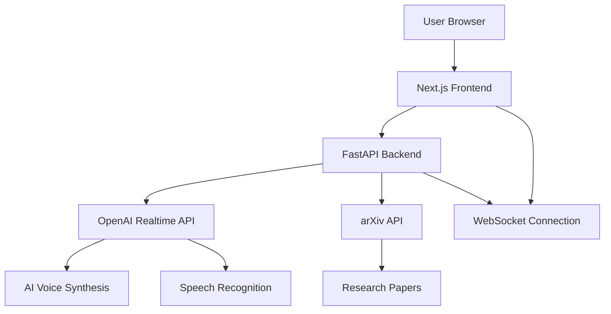

# 🎙️ Virtual Podcast Studio

A modern web application for discovering and analyzing research papers from arXiv to create AI-powered podcast content with real-time voice conversations.

## 🚀 Quick Start

### Prerequisites

- **Node.js 18+** (20+ preferred)
- **Python 3.8+**
- **OpenAI API Key** with Realtime API access

### 1. Clone and Setup

```bash
git clone <repository-url>
cd virtualpodcaststudio
```

### 2. Backend Setup

```bash
cd backend
python -m venv venv
source venv/bin/activate  # On Windows: venv\Scripts\activate
pip install -r requirements.txt

# Add your OpenAI API key
echo "OPENAI_API_KEY=your_key_here" > .env
```

### 3. Frontend Setup

```bash
cd podcast-studio
npm install
```

### 4. Start the Application

**Terminal 1 - Backend:**
```bash
cd backend
source venv/bin/activate
uvicorn main:app --host 0.0.0.0 --port 8000 --reload
```

**Terminal 2 - Frontend:**
```bash
cd podcast-studio
npm run dev
```

**Visit:** `http://localhost:3000/studio` to start your AI-powered podcast session!

## ✨ Features

### 🎤 Real-time Voice Conversations
- **AI-Powered Host**: Dr. Sarah, an expert AI researcher
- **Live Transcription**: Real-time speech-to-text
- **Voice Responses**: Natural AI voice synthesis
- **WebSocket Communication**: Low-latency real-time interaction

### 📚 Research Paper Integration
- **arXiv API**: Fetch latest research papers
- **Multi-Topic Selection**: AI, Physics, Math, Computer Vision, Robotics
- **Paper Analysis**: AI discusses and explains research findings
- **Topic Filtering**: Focus on specific research areas

### 🎨 Modern Interface
- **Dark Theme**: Professional GarageBand-inspired design
- **Responsive Layout**: Works on desktop and mobile
- **Real-time Status**: Connection and recording indicators
- **Clean UI**: Intuitive user experience

## 🏗️ Architecture



### Tech Stack
- **Frontend**: Next.js 15, TypeScript, Tailwind CSS, Shadcn/UI
- **Backend**: FastAPI, WebSocket, OpenAI Realtime API
- **APIs**: arXiv API, OpenAI Realtime API
- **Real-time**: WebSocket connections for low-latency communication

## 📡 API Endpoints

### Health Check
```http
GET /health
```

### Research Papers
```http
POST /api/papers
Content-Type: application/json

{
  "topics": ["cs.AI", "cs.CV", "cs.LG"]
}
```

### WebSocket Conversation
```http
WS /ws/conversation
```

**Message Types:**
- `{type: "audio", audio: "base64_data"}` - Voice input
- `{type: "text", text: "message"}` - Text input
- `{type: "session_ready"}` - Connection established
- `{type: "audio_delta", audio: "base64_data"}` - Streaming AI audio
- `{type: "text_delta", text: "partial_text"}` - Streaming AI text

## 🎯 Available Research Topics

| Topic Code | Description |
|------------|-------------|
| `cs.AI` | Artificial Intelligence |
| `cs.LG` | Machine Learning |
| `cs.CV` | Computer Vision |
| `cs.RO` | Robotics |
| `cs.CL` | Computation and Language |
| `cs.CR` | Cryptography and Security |
| `cs.DC` | Distributed Computing |
| `cs.DB` | Databases |

## 🔧 Development

### Frontend Commands
```bash
npm run dev          # Development server
npm run build        # Production build
npm run start        # Production server
npm run lint         # Code linting
npm run format       # Format with Prettier
```

### Backend Commands
```bash
uvicorn main:app --reload              # Development server
uvicorn main:app --host 0.0.0.0 --port 8000  # Production server
python -m pytest                      # Run tests
```

### Environment Variables

**Backend (.env):**
```bash
OPENAI_API_KEY=your_openai_api_key_here
OPENAI_REALTIME_MODEL=gpt-realtime
OPENAI_REALTIME_VOICE=alloy
```

## 🎙️ How to Use

1. **Start the Application**: Follow the Quick Start guide above
2. **Navigate to Studio**: Go to `http://localhost:3000/studio`
3. **Wait for Connection**: Status will show "CONNECTING" then "READY"
4. **Start Conversation**:
   - **Voice**: Click "Start Voice Recording" and speak
   - **Text**: Type a message and press Enter
5. **AI Response**: Dr. Sarah will respond with both voice and text
6. **Live Transcription**: Your speech appears in real-time

## 🐛 Troubleshooting

### Common Issues

**Backend not starting:**
- Check if port 8000 is available
- Verify Python virtual environment is activated
- Ensure all dependencies are installed

**Frontend not connecting:**
- Verify backend is running on port 8000
- Check browser console for WebSocket errors
- Ensure CORS is properly configured

**No AI response:**
- Verify OpenAI API key is valid
- Check account has Realtime API access
- Ensure sufficient API credits

**Audio issues:**
- Allow microphone permissions in browser
- Check audio device is working
- Verify WebSocket connection is stable

### Debug Mode

Enable detailed logging by checking browser DevTools → Console for emoji-marked logs:
- 🔌 Connection status
- 🎤 Audio processing
- 💬 AI responses
- ✅ Success indicators
- ❌ Error messages

## 📚 Documentation

All essential setup, usage, troubleshooting, and architecture information is covered in this README. Refer to the sections above for Quick Start, Features, Architecture, API Endpoints, Environment Variables, and Troubleshooting.

## 🤝 Contributing

1. Fork the repository
2. Create a feature branch
3. Make your changes
4. Test thoroughly
5. Submit a pull request

## 📄 License

MIT License - see LICENSE file for details
