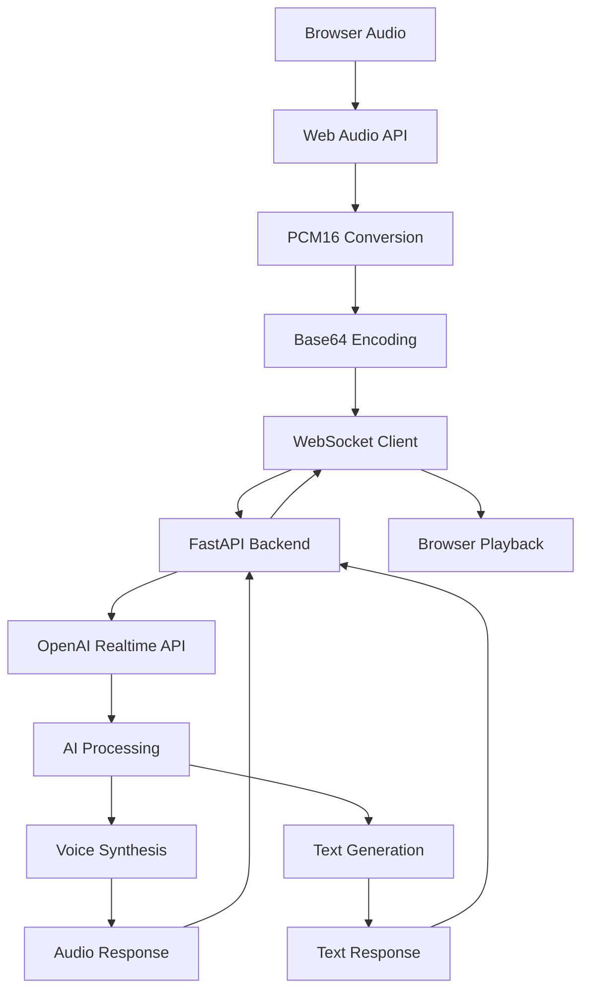

# 🔧 OpenAI Realtime API - Technical Implementation

> **Note**: For setup instructions, see [SETUP_INSTRUCTIONS.md](SETUP_INSTRUCTIONS.md)

## 🏗️ Architecture Overview



## 🔌 WebSocket Protocol

### Connection Endpoint
```http
WS /ws/conversation
```

### Message Flow

**Client → Server:**
```json
{
  "type": "audio",
  "audio": "base64_encoded_pcm16_data"
}
```

```json
{
  "type": "text", 
  "text": "Hello, can you explain this research paper?"
}
```

**Server → Client:**
```json
{
  "type": "session_ready",
  "message": "Connected to OpenAI Realtime API"
}
```

```json
{
  "type": "audio_delta",
  "audio": "base64_encoded_ai_audio"
}
```

```json
{
  "type": "text_delta",
  "text": "I'd be happy to explain..."
}
```

```json
{
  "type": "response_done",
  "message": "AI response completed"
}
```

## 🎤 Audio Processing Pipeline

### Frontend Audio Capture
```typescript
// AudioWorklet for real-time processing
class PCM16Processor extends AudioWorkletProcessor {
  process(inputs: Float32Array[][]) {
    // Convert float32 to PCM16
    const pcm16 = this.float32ToPCM16(inputs[0][0]);
    
    // Send to main thread
    this.port.postMessage({ audio: pcm16 });
    
    return true;
  }
}
```

### Backend Audio Handling
```python
async def handle_audio_message(websocket, message):
    # Decode base64 audio
    audio_data = base64.b64decode(message["audio"])
    
    # Send to OpenAI
    await openai_session.transport.sendEvent({
        "type": "input_audio_buffer.append",
        "audio": audio_data
    })
```

## 🤖 OpenAI Session Configuration

### Session Parameters
```python
session_config = {
    "modalities": ["text", "audio"],
    "instructions": "You are Dr. Sarah, an AI research expert...",
    "voice": "alloy",
    "input_audio_format": "pcm16",
    "output_audio_format": "pcm16",
    "input_audio_transcription": {
        "model": "whisper-1"
    },
    "turn_detection": {
        "type": "server_vad",
        "threshold": 0.5,
        "prefix_padding_ms": 300,
        "silence_duration_ms": 500
    },
    "temperature": 0.8
}
```

### Voice Activity Detection
- **Server-side VAD**: Automatic speech detection
- **Threshold**: 0.5 (adjustable for sensitivity)
- **Padding**: 300ms prefix, 500ms silence detection
- **Turn Management**: Automatic commit on silence

## 🔄 Real-time Event Handling

### Frontend Event Loop
```typescript
websocket.onmessage = (event) => {
  const data = JSON.parse(event.data);
  
  switch(data.type) {
    case 'session_ready':
      setConnectionStatus('READY');
      break;
    case 'audio_delta':
      playAudioChunk(data.audio);
      break;
    case 'text_delta':
      updateTranscript(data.text);
      break;
    case 'response_done':
      stopAudioPlayback();
      break;
  }
};
```

### Backend Event Processing
```python
async def process_openai_events():
    async for event in openai_session:
        if event.type == "audio.delta":
            await websocket.send_json({
                "type": "audio_delta",
                "audio": base64.b64encode(event.data).decode()
            })
        elif event.type == "response.text.delta":
            await websocket.send_json({
                "type": "text_delta", 
                "text": event.delta
            })
```

## 📊 Performance Characteristics

### Latency Metrics
- **Audio Capture**: ~40ms chunks
- **Network Transmission**: ~10-50ms
- **OpenAI Processing**: ~200-1000ms
- **Audio Playback**: ~50ms buffer
- **Total End-to-End**: ~300-1200ms

### Throughput
- **Audio Chunks**: ~25 per second
- **Data Rate**: ~32KB/s (PCM16 mono 16kHz)
- **WebSocket Messages**: ~25-50 per second

## 🛠️ Development Tools

### Debug Logging
```python
# Backend logging
logger.info("🎤 Processing audio chunk from client")
logger.info("📤 Sending to OpenAI Realtime API")
logger.info("🔊 Playing audio delta from AI")
```

```javascript
// Frontend logging
console.log("🎵 AudioContext created, sample rate:", sampleRate);
console.log("🔊 Audio chunk processed, length:", chunk.length);
console.log("📤 Sending PCM16 audio data to WebSocket");
```

### Testing Endpoints
```bash
# Health check
curl http://localhost:8000/health

# WebSocket test
wscat -c ws://localhost:8000/ws/conversation
```

## 🔒 Security Considerations

### API Key Management
- **Environment Variables**: Never commit API keys
- **Server-side Only**: Keys never exposed to frontend
- **Rotation**: Regular key rotation recommended

### WebSocket Security
- **CORS**: Configured for localhost development
- **Rate Limiting**: Implement for production
- **Authentication**: Add user auth for multi-user support

## 🚀 Production Deployment

### Requirements
- **HTTPS**: Required for OpenAI Realtime API
- **WebSocket Support**: Ensure proxy supports WebSocket
- **Audio Permissions**: HTTPS required for microphone access

### Scaling Considerations
- **Session Pooling**: Multiple OpenAI sessions
- **Load Balancing**: Distribute WebSocket connections
- **Audio Caching**: Cache common responses
- **Monitoring**: Track latency and error rates

## 📈 Monitoring & Analytics

### Key Metrics
- **Connection Success Rate**: WebSocket connections
- **Audio Quality**: Chunk processing success
- **Response Time**: End-to-end latency
- **Error Rate**: Failed requests and timeouts

### Logging Strategy
```python
# Structured logging
logger.info("audio_processed", extra={
    "chunk_size": len(audio_data),
    "processing_time": processing_time,
    "session_id": session_id
})
```

## 🔧 Troubleshooting

### Common Issues
1. **WebSocket Connection Failed**: Check CORS and proxy settings
2. **Audio Not Processing**: Verify microphone permissions
3. **High Latency**: Check network and OpenAI API status
4. **Session Timeout**: Implement reconnection logic

### Debug Commands
```bash
# Check OpenAI API status
curl -H "Authorization: Bearer $OPENAI_API_KEY" \
     https://api.openai.com/v1/models

# Test WebSocket connection
websocat ws://localhost:8000/ws/conversation
```
